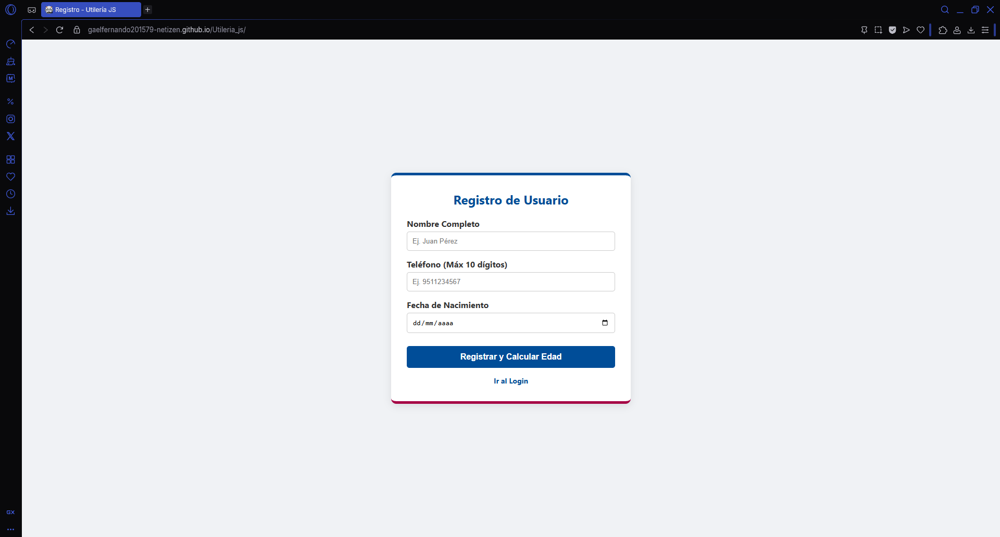
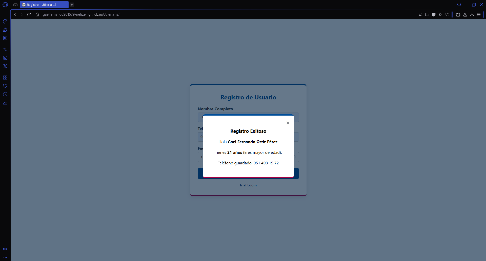
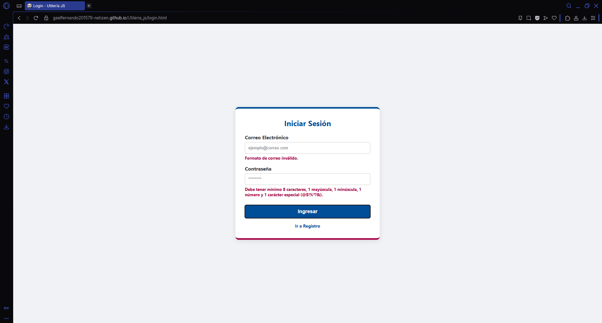
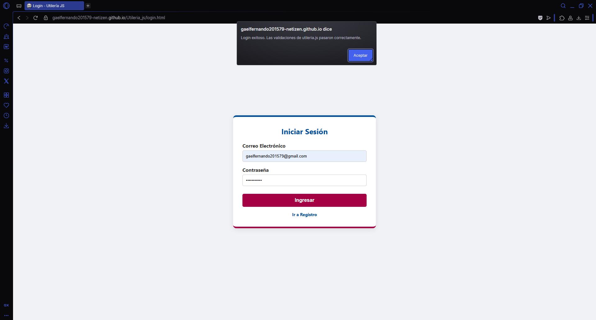

# Utileria.js - Librería de Validación Front-End

**Autor:** Ortíz Pérez Gael Fernando

**Problema que resuelve:** Simplifica la validación de formularios en el cliente mediante funciones de JavaScript, eliminando de esta forma la necesidad de importar frameworks pesados y/o complicados para tareas rutinarias como validar correos, contraseñas seguras y calcular edades.

## Descripción General

`utileria.js` es una librería de **JavaScript** que proporciona funciones reutilizables para validar datos comunes en formularios y aplicaciones web: correos electrónicos, cadenas alfabéticas y valores numéricos.

Está pensada para ser **ligera, portable y fácil de integrar** en cualquier proyecto.

---

## Enlace en GitHub Pages

https://gaelfernando201579-netizen.github.io/Utileria_js/

## Instalación

Para utilizar esta librería en cualquiera de tus proyectos, simplemente descarga el archivo `utileria.js` y enlázalo en tu documento HTML antes del cierre de la etiqueta `<body>` o dentro de la etiqueta `<head>`:

```html
<script src="js/utileria.js"></script>

o

<head>
  <script src="js/utileria.js"></script>
</head>
```

## Capturas de Pantalla

**Formulario de Registro**


**Validación de Registro**


**Modal de Registro**


**Validación del index**


**Alerta de Registro Exitoso**


## Video Demostrativo

[](https://youtu.be/MP6Sz0VIzWI)

## Índice

- [Funciones Obligatorias](#funciones-obligatorias)
  1. [`validarCorreo(correo)`](#1-validarcorreocorreo)
  2. [`soloLetras(texto)`](#2-sololetrastexto)
  3. [`validarLongitud(numero, maxLongitud)`](#3-validarlongitudnumero-maxlongitud)
  4. [`calcularEdad(fechaNacimiento)`](#4-calcularedadfechanacimiento)
  5. [`esMayorDeEdad(fechaNacimiento)`](#5-esmayordeedadfechanacimiento)
  6. [`validarPassword(password)`](#6-validarpasswordpassword)
- [Funciones Adicionales](#funciones-adicionales) 7. [`formatearTelefonoMX(telefono)`](#7-formateartelefonomxtelefono) 8. [`limpiarTexto(texto)`](#8-limpiartextotexto)

---

## Funciones Obligatorias

### 1. `validarCorreo(correo)`

**Propósito:** Valida si una cadena tiene el formato básico de un correo electrónico.

**Parámetros:**

| Nombre   | Tipo   | Descripción                   |
| -------- | ------ | ----------------------------- |
| `correo` | string | Cadena a validar como correo. |

**Retorna:** `boolean` — `true` si cumple con el formato, `false` en caso contrario.

**Implementación:**

```javascript
function validarCorreo(correo) {
  const regex = /^[^\s@]+@[^\s@]+\.[^\s@]+$/;
  return regex.test(correo);
}
```

**Cómo funciona el regex paso a paso:**

| Fragmento | Significado                                                          |
| --------- | -------------------------------------------------------------------- |
| `^`       | Inicio de la cadena.                                                 |
| `[^\s@]+` | Uno o más caracteres que **no** sean espacio (`\s`) ni arroba (`@`). |
| `@`       | Debe contener exactamente una arroba.                                |
| `[^\s@]+` | Dominio: uno o más caracteres que no sean espacio ni arroba.         |
| `\.`      | Un punto literal (escapado).                                         |
| `[^\s@]+` | Extensión (TLD): uno o más caracteres sin espacio ni arroba.         |
| `$`       | Fin de la cadena.                                                    |

**Ejemplos:**

```javascript
validarCorreo("usuario@dominio.com"); // true
validarCorreo("a@b.co"); // true
validarCorreo("sin-arroba.com"); // false
validarCorreo("usuario@dominio"); // false (falta TLD)
validarCorreo("usuario @dominio.com"); // false (espacio)
```

---

### 2. `soloLetras(texto)`

**Propósito:** Valida que un texto contenga **únicamente letras** (incluyendo acentos y la `ñ`) y espacios, y que no esté vacío.

**Parámetros:**

| Nombre  | Tipo   | Descripción       |
| ------- | ------ | ----------------- |
| `texto` | string | Cadena a validar. |

**Retorna:** `boolean` — `true` si solo contiene letras/espacios y no está vacío.

**Implementación:**

```javascript
function soloLetras(texto) {
  const regex = /^[a-zA-ZáéíóúÁÉÍÓÚñÑ\s]+$/;
  return regex.test(texto) && texto.trim().length > 0;
}
```

**Cómo funciona:**

1. **Regex** `^[a-zA-ZáéíóúÁÉÍÓÚñÑ\s]+$`:
   - `a-z` / `A-Z`: letras inglesas básicas.
   - `áéíóúÁÉÍÓÚ`: vocales acentuadas (minúsculas y mayúsculas).
   - `ñÑ`: la letra eñe en ambos casos.
   - `\s`: cualquier espacio en blanco (espacios, tabs, saltos de línea).
   - `+`: uno o más caracteres del conjunto.
   - `^...$`: ancla toda la cadena.

2. **Doble condición:** además del regex, se verifica con `texto.trim().length > 0` que **no sea una cadena vacía o solo espacios**.

**Ejemplos:**

```javascript
soloLetras("Juan Pérez"); // true
soloLetras("María José"); // true
soloLetras("Muñoz"); // true
soloLetras("Juan123"); // false (contiene números)
soloLetras("Juan-Pérez"); // false (guion no permitido)
soloLetras("   "); // false (solo espacios)
soloLetras(""); // false (vacío)
```

---

### 3. `validarLongitud(numero, maxLongitud)`

**Propósito:** Valida que un valor sea **numérico entero positivo** y que su cantidad de dígitos **no exceda** un máximo permitido.

**Parámetros:**

| Nombre        | Tipo             | Descripción                              |
| ------------- | ---------------- | ---------------------------------------- |
| `numero`      | number \| string | Valor a validar (se convierte a string). |
| `maxLongitud` | number           | Cantidad máxima de dígitos permitidos.   |

**Retorna:** `boolean` — `true` si es numérico y no supera la longitud máxima.

**Implementación:**

```javascript
function validarLongitud(numero, maxLongitud) {
  const numStr = numero.toString().trim();
  const esNumero = /^\d+$/.test(numStr);
  return esNumero && numStr.length <= maxLongitud;
}
```

**Cómo funciona:**

1. `numero.toString().trim()` → convierte el valor a cadena y elimina espacios extremos.
2. `/^\d+$/` → valida que **todos** los caracteres sean dígitos (`0-9`), sin signos, sin decimales, sin letras.
3. `numStr.length <= maxLongitud` → verifica que la cantidad de dígitos no exceda el límite.

**Ejemplos:**

```javascript
validarLongitud("12345", 5); // true  (5 dígitos, límite 5)
validarLongitud("123456", 5); // false (6 dígitos > 5)
validarLongitud(123, 5); // true  (number → string)
validarLongitud("12a45", 5); // false (contiene letra)
validarLongitud("-123", 5); // false (signo negativo no permitido)
validarLongitud("12.5", 5); // false (punto decimal no permitido)
validarLongitud("", 5); // false (vacío)
```

---

### 4. `calcularEdad(fechaNacimiento)`

**Propósito:** Calcula la edad en años a partir de una fecha de nacimiento en formato `YYYY-MM-DD`.

**Parámetros:**

| Nombre            | Tipo   | Descripción                                  |
| ----------------- | ------ | -------------------------------------------- |
| `fechaNacimiento` | string | Fecha de nacimiento en formato `YYYY-MM-DD`. |

**Retorna:** `number` — Edad en años cumplidos.

**Implementación:**

```javascript
function calcularEdad(fechaNacimiento) {
  const fechaNac = new Date(fechaNacimiento);
  // Ajuste de zona horaria para evitar desfasamiento de días
  const fechaNacLocal = new Date(
    fechaNac.getTime() + Math.abs(fechaNac.getTimezoneOffset() * 60000),
  );
  const hoy = new Date();

  let edad = hoy.getFullYear() - fechaNacLocal.getFullYear();
  const mes = hoy.getMonth() - fechaNacLocal.getMonth();

  if (mes < 0 || (mes === 0 && hoy.getDate() < fechaNacLocal.getDate())) {
    edad--;
  }
  return edad;
}
```

**Cómo funciona:**

1. Convierte la cadena a un objeto `Date`.
2. **Ajuste de zona horaria:** compensa el desfase UTC para evitar que fechas cercanas a medianoche se interpreten como el día anterior.
3. Calcula la diferencia de años (`año actual - año nacimiento`).
4. Ajusta restando 1 si **aún no ha cumplido años** este año (mes actual menor, o mismo mes pero día actual menor).

**Ejemplos:**

```javascript
calcularEdad("2000-05-15"); // número entero (ej. 24, 25, ...)
calcularEdad("2010-12-31"); // edad según el día actual
calcularEdad("1990-01-01"); // persona adulta
```

---

### 5. `esMayorDeEdad(fechaNacimiento)`

**Propósito:** Determina si una persona es **mayor de edad** (18 años o más) a partir de su fecha de nacimiento.

**Parámetros:**

| Nombre            | Tipo   | Descripción                                  |
| ----------------- | ------ | -------------------------------------------- |
| `fechaNacimiento` | string | Fecha de nacimiento en formato `YYYY-MM-DD`. |

**Retorna:** `boolean` — `true` si tiene 18 años o más, `false` en caso contrario.

**Implementación:**

```javascript
function esMayorDeEdad(fechaNacimiento) {
  return calcularEdad(fechaNacimiento) >= 18;
}
```

**Cómo funciona:**

Reutiliza `calcularEdad` y compara el resultado con `18`. Es un wrapper de conveniencia para validaciones rápidas.

**Ejemplos:**

```javascript
esMayorDeEdad("2000-05-15"); // true
esMayorDeEdad("2015-08-20"); // false (menor)
```

---

### 6. `validarPassword(password)`

**Propósito:** Valida que una contraseña cumpla con requisitos mínimos de seguridad: al menos **8 caracteres**, con **mayúscula**, **minúscula**, **número** y **carácter especial**.

**Parámetros:**

| Nombre     | Tipo   | Descripción           |
| ---------- | ------ | --------------------- |
| `password` | string | Contraseña a validar. |

**Retorna:** `boolean` — `true` si cumple todos los requisitos, `false` en caso contrario.

**Implementación:**

```javascript
function validarPassword(password) {
  const regex =
    /^(?=.*[a-z])(?=.*[A-Z])(?=.*\d)(?=.*[@$!%*?&])[A-Za-z\d@$!%*?&]{8,}$/;
  return regex.test(password);
}
```

**Cómo funciona el regex (lookaheads):**

| Fragmento               | Significado                                                         |
| ----------------------- | ------------------------------------------------------------------- |
| `^`                     | Inicio de la cadena.                                                |
| `(?=.*[a-z])`           | **Lookahead:** debe contener al menos una minúscula.                |
| `(?=.*[A-Z])`           | **Lookahead:** debe contener al menos una mayúscula.                |
| `(?=.*\d)`              | **Lookahead:** debe contener al menos un dígito.                    |
| `(?=.*[@$!%*?&])`       | **Lookahead:** debe contener al menos un carácter especial del set. |
| `[A-Za-z\d@$!%*?&]{8,}` | Cuerpo: 8 o más caracteres de los permitidos.                       |
| `$`                     | Fin de la cadena.                                                   |

**Ejemplos:**

```javascript
validarPassword("Abc123!x"); // true
validarPassword("Abc1!"); // false (menos de 8)
validarPassword("abcdefg1!"); // false (sin mayúscula)
validarPassword("ABCDEFG1!"); // false (sin minúscula)
validarPassword("Abcdefgh!"); // false (sin número)
validarPassword("Abcdefg1"); // false (sin especial)
```

---

## Funciones Adicionales

### 7. `formatearTelefonoMX(telefono)`

**Propósito:** Formatea una cadena de **10 dígitos** a un formato de teléfono legible para México: `XXX XXX XX XX`.

**Parámetros:**

| Nombre     | Tipo             | Descripción                       |
| ---------- | ---------------- | --------------------------------- |
| `telefono` | number \| string | Número de teléfono de 10 dígitos. |

**Retorna:** `string` — Teléfono formateado, o el valor original si no tiene 10 dígitos.

**Implementación:**

```javascript
function formatearTelefonoMX(telefono) {
  const num = telefono.toString().replace(/\D/g, "");
  if (num.length === 10) {
    return num.replace(/(\d{3})(\d{3})(\d{2})(\d{2})/, "$1 $2 $3 $4");
  }
  return telefono;
}
```

**Cómo funciona:**

1. Convierte a string y elimina **todo lo que no sea dígito** (`\D` → no-dígito).
2. Si quedan exactamente 10 dígitos, aplica el formato `XXX XXX XX XX`.
3. Si no, retorna el valor original sin modificar.

**Ejemplos:**

```javascript
formatearTelefonoMX("5512345678"); // "551 234 56 78"
formatearTelefonoMX("55-1234-5678"); // "551 234 56 78"
formatearTelefonoMX("(55) 1234 5678"); // "551 234 56 78"
formatearTelefonoMX("12345"); // "12345" (sin cambios)
formatearTelefonoMX(5512345678); // "551 234 56 78"
```

---

### 8. `limpiarTexto(texto)`

**Propósito:** Normaliza un texto eliminando espacios al inicio/final y colapsando espacios internos múltiples en uno solo.

**Parámetros:**

| Nombre  | Tipo   | Descripción          |
| ------- | ------ | -------------------- |
| `texto` | string | Cadena a normalizar. |

**Retorna:** `string` — Texto limpio con espacios simples.

**Implementación:**

```javascript
function limpiarTexto(texto) {
  return texto.trim().replace(/\s+/g, " ");
}
```

**Cómo funciona:**

1. `trim()` → elimina espacios, tabs y saltos de línea al inicio y al final.
2. `replace(/\s+/g, ' ')` → reemplaza cualquier secuencia de espacios en blanco (uno o más) por **un solo espacio**.

**Ejemplos:**

```javascript
limpiarTexto("   Hola   mundo   "); // "Hola mundo"
limpiarTexto("Juan\t\tPérez"); // "Juan Pérez"
limpiarTexto("línea1\n\nlínea2"); // "línea1 línea2"
limpiarTexto("  "); // ""
```
